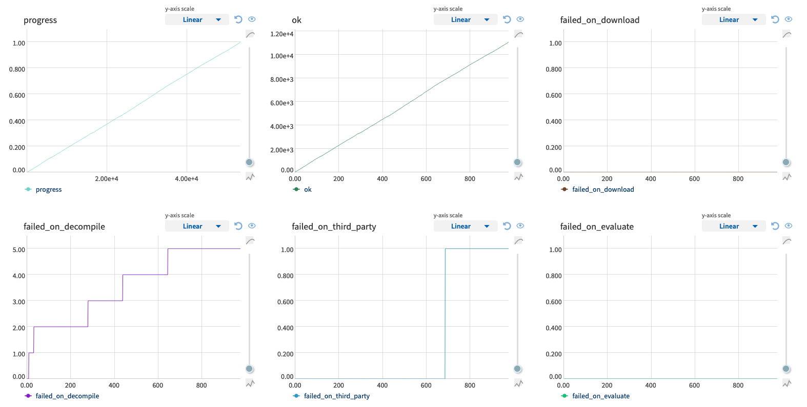

# Installation

You can either run the tool using our resources, or try to make it working by yourself. 

## Docker image and MyBinder.org notebooks

If you don't want to analyze large dataset by yourself, you can use our pre-processed dataset from [this Jupyter notebook](https://tba.com). Would you insist on going through the decompilation, you can use our Docker image with

```bash
docker pull adamjanovsky/cryptomlw:latest \
& docker run -it adamjanovsky/cryptomlw
```

Inside the image, you can run our toy experiment with

```bash
cd AndroidMalwareCrypto \
&& ./cli_process.py sample_experiment/configs/dataset_processing/config_processing.yml
```

and then see the output in `/home/user/AndroidMalwareCrypto/sample_experiment/dataset/`. 

For exporting outputs outside of the container, we recommend [Docker volumes](https://docs.docker.com/storage/volumes/).

## Dependencies

The rest of this document describes how to make our tool work on your local machine (unix). You're going to need Python 3.8. Start with the following

```bash
python3 -m venv venv \
& source venv/bin/activate \
& pip3 install -r requirements.txt
```

and continue with resolving the dependencies below. You can also use the [Dockerfile](https://github.com/adamjanovsky/AndroidMalwareCrypto/blob/dev/docker/Dockerfile) that illustrates which commands were needed to run our tool on vanilla Ubuntu (without Neptune and Androzoo integration, however).

### Neptune integration

The project is capabple of being fully integrated with [Neptune.ai](Neptune.ai). This allows the user to track all experiments performed with the project. Most notably, it is possible to monitor a progress of long-running experiment. 



If you wish to integrate Neptune.ai with this tool, you simply have to register at [Neptune.ai](neptune.ai) and specify the following options in the configuration file:

```
is_being_logged: True # If you want to log in Neptune.ai or not.
neptune_project_name: 'Team/YourProjectName' # Name of project in the Neptune.ai
experiment_name: 'MyLittleExperiment' # Name of experiment for the Neptune.ai
```

If you do not want to integrate with Neptune.ai, simply put `is_being_logged: False` to the experiment config and should be safe to go.

### Androguard and Jadx integration

We decided to use [Jadx decompiler](https://github.com/skylot/jadx) instead of the Androguard's default DAD. That is because Jadx decompiler, from our experience, produces cleaner source code (don't forget to use patched version of androguard mentioned in requirements.txt). Naturally, you need to have [Jadx](https://github.com/skylot/jadx) installed and present in a path. To navigate `androidcrypto` to your `jadx` decompiler, specify the following option in the configuration file:

```
jadx_path: '/path/to/jadx/build/jadx/bin/jadx' # Path to the jadx binary in your system, keep it 'jadx' if jadx is in your system path
```

### Literadar integration

Detection of third-party libraries usage uses the fork of [LiteRadar](https://github.com/adamjanovsky/LiteRadar) script under the hood. That script is being executed as python2 process, so you need to have python2 (2.7) functionable as well on your computer. Make sure to specify the path to the LiteRadar binary in the experiment config using the following parameter:

```
literadar_path: '/path/to/LiteRadar/LiteRadar/literadar.py' # Path to the LiteRadar python2 script
```

### Euphony integration

Possibly, you can also let [Euphony](https://core.ac.uk/download/pdf/83926508.pdf) label your malware samples with family names and types. Note that this functionality will probably fail when applied outside of the Androzoo dataset (more precisely it will result in `None` labels). 

In order to integrate Euphony with `androidcrypto`, you have to download the labels from [Androzoo website](https://androzoo.uni.lu/labels) and navigate the `androidcrypto` to these files using the following configuration keys:

```
euphony_names_path: '/path/to/euphony/names_proposed.json'
euphony_types_path: '/path/to/euphony/types_proposed.json'  
```

